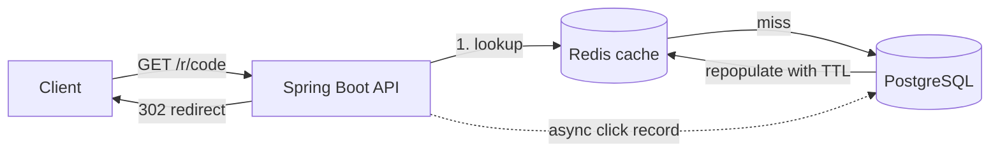

# URL Shortener with Click Analytics

A URL shortening service built with **Spring Boot, PostgreSQL, Redis and Docker**. It supports base62 short codes, custom aliases, link expiry, JWT authentication and per-link click analytics.

## Features

- **Short links** generated by base62-encoding the database ID, so codes are unique without collision checks
- **Custom aliases** with a uniqueness check against the database
- **Link expiry** via an optional `expiresAt` timestamp
- **Click analytics** per link: total clicks, clicks per day and top referrers
- **Redis caching** on the redirect path to keep lookups fast
- **Async click recording** so analytics writes never slow down redirects
- **JWT authentication** (stateless, `Authorization: Bearer <token>`)
- **One-command setup** with Docker Compose

## Tech Stack

| Layer | Technology |
|---|---|
| Backend | Java 17, Spring Boot |
| Database | PostgreSQL |
| Cache | Redis |
| Auth | JWT |
| Containerization | Docker, Docker Compose |
| Load testing | k6 |
| Deployment | AWS EC2 |

## Architecture



**How a redirect works**

1. `GET /r/{code}` checks Redis first (`link:{code}` maps to `id::longUrl`).
2. On a cache miss, the app reads from PostgreSQL and writes the result back to Redis with a TTL (`app.link-cache-ttl-seconds` in `application.yml`).
3. The click is recorded on a separate thread (`@Async` in `ClickService`), so analytics never adds latency to the redirect response.
4. The client receives an HTTP `302` with the long URL in the `Location` header.

## Getting Started

### Prerequisites

- [Docker Desktop](https://www.docker.com/products/docker-desktop/) (includes Docker Compose)
- [k6](https://k6.io/docs/get-started/installation/) (only for load testing)
- Java 17 (only if you want to run outside Docker)

PostgreSQL and Redis run in containers, so you don't need to install them.

### Run locally

```bash
git clone https://github.com/Trishabalakrishana/<repo-name>.git
cd <repo-name>
docker compose up --build
```

The first build takes a few minutes. When you see `Started UrlShortenerApplication`, the API is live at `http://localhost:8080`.

## API Reference

| Method | Endpoint | Description |
|---|---|---|
| `POST` | `/api/auth/register` | Register a user and receive a JWT |
| `POST` | `/api/links` | Create a short link (optional `customAlias`, `expiresAt`) |
| `GET` | `/r/{code}` | Redirect to the original URL (`302`) |
| `GET` | `/api/links/{code}/analytics` | Total clicks, clicks per day, top referrers |

### Example usage

**Register a user**

```bash
curl -X POST http://localhost:8080/api/auth/register \
  -H "Content-Type: application/json" \
  -d '{"email":"you@example.com","password":"password123"}'
```

**Create a short link**

```bash
curl -X POST http://localhost:8080/api/links \
  -H "Content-Type: application/json" \
  -d '{"longUrl":"https://www.google.com"}'
```

The response includes `shortCode` and `shortUrl`.

**Create a link with a custom alias and expiry**

```bash
curl -X POST http://localhost:8080/api/links \
  -H "Content-Type: application/json" \
  -d '{"longUrl":"https://www.github.com","customAlias":"my-repo","expiresAt":"2026-12-31T00:00:00Z"}'
```

**Follow a short link**

```bash
curl -i http://localhost:8080/r/1
```

Returns `HTTP/1.1 302` with a `Location` header pointing at the long URL.

**View analytics**

```bash
curl http://localhost:8080/api/links/1/analytics
```

## Load Testing

Load tests use [k6](https://k6.io). Create at least one short link first and note its code.

**With cache (warm)**

```bash
curl http://localhost:8080/r/1        # warm the cache
k6 run -e SHORT_CODE=1 k6/load-test.js
```

**Without cache**

Flushing Redis mid-run doesn't give a true no-cache result, because the first request repopulates it. For a clean comparison, comment out the Redis read/write lines in `LinkService.resolve()`, rebuild and re-run k6.

### Results

| Configuration | Requests/sec | p95 latency |
|---|---|---|
| Cache disabled | _add result_ | _add result_ |
| Cache enabled | _add result_ | _add result_ |

_Tested on: add machine / instance type here._

## Deployment (AWS EC2)

1. Launch a `t2.micro` or `t3.micro` Ubuntu 22.04 instance (free tier).
2. In its Security Group, open inbound ports `22` (SSH) and `8080` (API).
3. SSH in and install Docker:
   ```bash
   sudo apt update && sudo apt install -y docker.io docker-compose-v2
   sudo usermod -aG docker $USER
   # log out and back in for the group change to apply
   ```
4. Copy the project to the instance:
   ```bash
   scp -i your-key.pem -r ./urlshortener ubuntu@<ec2-public-ip>:~/
   ```
5. Set `BASE_URL` in the `app` service of `docker-compose.yml` to `http://<ec2-public-ip>:8080`, so generated short URLs use the public address.
6. Start the stack:
   ```bash
   cd urlshortener
   docker compose up --build -d
   ```

A single-vCPU burstable instance will cap throughput regardless of application efficiency, so keep that in mind when reading load-test numbers from EC2.

## Known Limitations and Future Work

- Rate limiting on link creation (Redis with a token bucket)
- Database migrations with Flyway or Liquibase (currently `ddl-auto: update`)
- Refresh tokens (the JWT is access-token-only with a 24h expiry)
- HTTPS/TLS termination behind nginx or an AWS ALB
- Analytics endpoint is currently open and could be restricted to the link owner


